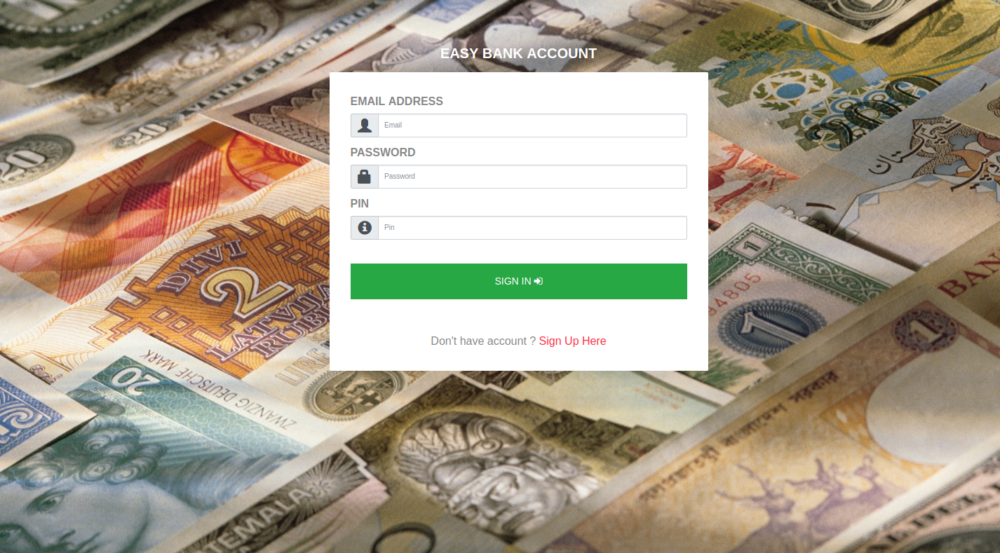

# online-banking
This is a online banking system for local businesses. 
easybank contains a user interface as well as a user authentication system   

1) Install easybank:   

 i) Download the online-banking project and unzip  
 
 ii) Rename the online-project and give name easybank   
 
 iii) Copy the folder easybank in to /var/www/ e.x /var/www/easybank  

 iv) Import the easybank.sql file from sql folder in to your database    

2) Use stripe withdrawals:   

 i) insert the private_test_key and the public_test_key from the user in to the table customers in database   
 
 ii) This is an example for use stripe widrawals (available in the platform)   
 

     $pieces = explode(" ", $_POST['recipient']);
     $lastname = $pieces[0];
     $firstname = $pieces[1]; 

     $sql3  = "select publishable_key_stripe, secret_key_stripe from customers
                where lastname = '$lastname' and firstname = '$firstname'";
     $result3 = $conn->query($sql3);

     while ($row3 = $result3->fetch_assoc())
       {

      echo $row3['publishable_key_stripe'] ." " .$row3['secret_key_stripe'];

     require 'widrawals/stripe/Stripe.php';

     $params = array(
	"testmode"   => "on",
	"private_live_key" => "sk_live_xxxxxxxxxxxxxxxxxxxxx",
	"public_live_key"  => "pk_live_xxxxxxxxxxxxxxxxxxxxx",
	"private_test_key" =>  "{$row3['secret_key_stripe']}",
	"public_test_key"  =>  "{$row3['publishable_key_stripe']}"
      );

    if ($params['testmode'] == "on") {
	Stripe::setApiKey($params['private_test_key']);
	$pubkey = $params['public_test_key'];
    }    else {
	Stripe::setApiKey($params['private_live_key']);
	$pubkey = $params['public_live_key'];
      }

     if(isset($_POST['stripeToken']))
      {
	$amount_cents = str_replace(".","",$_POST['amount']);  // Chargeble amount
        $main_amount = $_POST['main_amount'];
        $secondary_amount = $_POST['secondary_amount'];
        $amount_cents = $main_amount .$secondary_amount;

        $length_code = 8;
        $invoiceid = substr(str_shuffle("123456789"),0, $length_code); // Invoice ID
                   
	$description = "Invoice #" . $invoiceid . " - " . $invoiceid;
	
	try {

		$charge = Stripe_Charge::create(array(		 
			  "amount" => $amount_cents,
			  "currency" => "usd",
			  "source" => $_POST['stripeToken'],
			  "description" => $description)			  
		);

		if ($charge->card->address_zip_check == "fail") {
			throw new Exception("zip_check_invalid");
		} else if ($charge->card->address_line1_check == "fail") {
			throw new Exception("address_check_invalid");
		} else if ($charge->card->cvc_check == "fail") {
			throw new Exception("cvc_check_invalid");
		}
		// Payment has succeeded, no exceptions were thrown or otherwise caught				

		$result = "success";

	} catch(Stripe_CardError $e) {			

	$error = $e->getMessage();
		$result = "declined";

	} catch (Stripe_InvalidRequestError $e) {
		$result = "declined";		  
	} catch (Stripe_AuthenticationError $e) {
		$result = "declined";
	} catch (Stripe_ApiConnectionError $e) {
		$result = "declined";
	} catch (Stripe_Error $e) {
		$result = "declined";
	} catch (Exception $e) {

		if ($e->getMessage() == "zip_check_invalid") {
			$result = "declined";
		} else if ($e->getMessage() == "address_check_invalid") {
			$result = "declined";
		} else if ($e->getMessage() == "cvc_check_invalid") {
			$result = "declined";
		} else {
			$result = "declined";
		}		  
	}

          if ($result ==  true)
              { 
              echo '';
              echo ("");
                }

      }

      } // end of while
         

 

3) Details:   

It has a money transfer for the same system of your easybank business as well as for any other easybank system of another business.
It has information about user moves.
You can see the representation of your trading live charting.
It can export the data in pdf format.
It transfers money to and from bank accounts (stripe) via credit cards from any bank. <br.  

   
